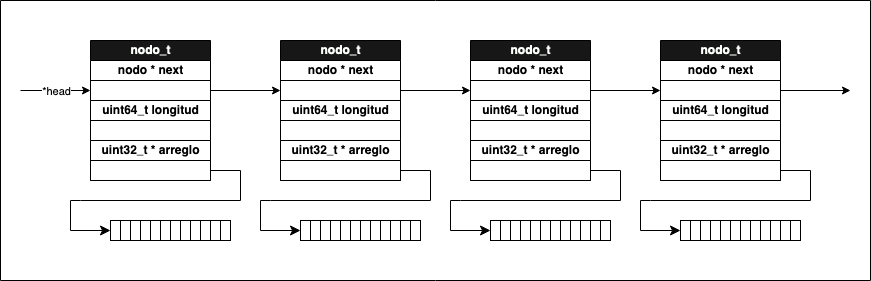

# Anotaciones sobre Taller 2 #

Anotaciones y respuestas a preguntas de distintos items del taller.

## Lista Enlazada ##

Si dentro de una funcion cualquiera, creamos una lista haciendo `lista_t* mi_lista = nueva_lista();` y luego
otra haciendo `lista_t mi_otra_lista;` ¿en que segmentos de memoria se alojan las siguientes variables?: 

- `mi_lista`: Stack
- `mi_otra_lista`: Stack
- `mi_otra_lista.head`: Stack
- `mi_lista->head`: Heap

¿Y si a la lista `mi_otra_lista` la creamos fuera de cualquier función?
Respuesta: En el Heap.

## Ejercicio Integrador ##

#### ¿Por qué cuándo declaramos un string en C no hace falta especificar su tamaño de antemano? ####

- Porque C se encarga de hacer realloc a la string cuando se queda sin espacio el array.

#### Supongamos que ahora nos interesa implementar una función para retornar ambas listas de vocales y consonantes. El lenguaje C no nos provee ninguna forma sintáctica de retornar más de un dato de una función. Explorar distintas formas que se podría resolver este problema (al menos dos formas distintas, y que funcionen). ####

- Respuesta